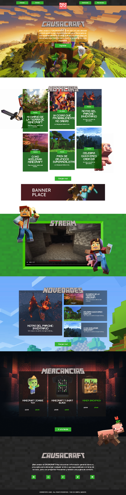

# Minecraft Efectos

Pagina web realizado solo con HTML, CSS y Javascript 	
 

Arquitectura y Entornos Web Cibertec - Proyecto Minecraft con efectos

Página de iconos -> https://fontawesome.com/search?o=r&m=free

Página de efectos -> https://wowjs.uk/

     
  

